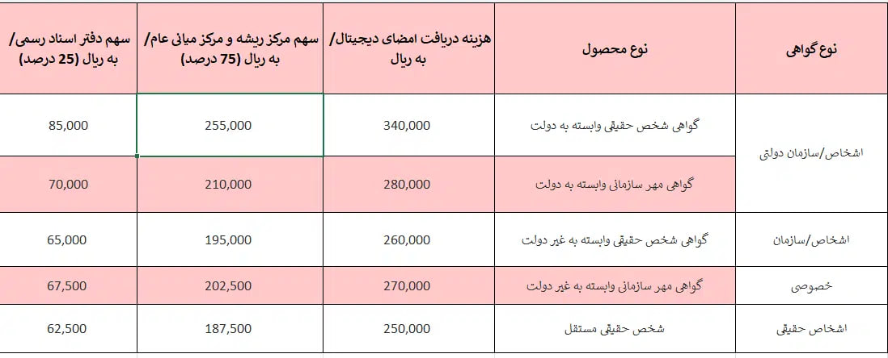
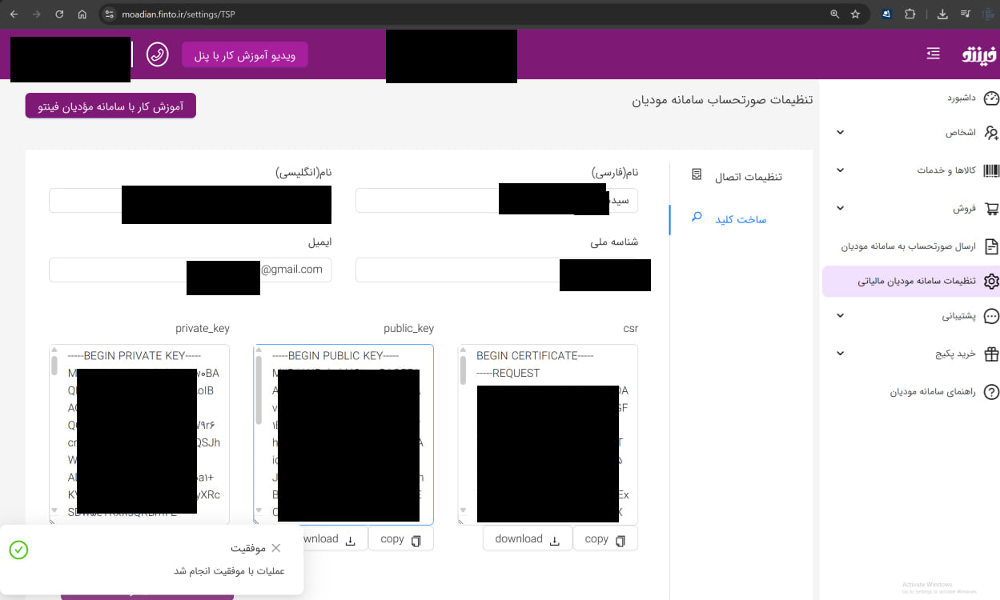

# moadian-api-example

A simple PHP-based example for connecting to Iran’s Moadian (مودیان) tax system API.

# What is moadian API?

The Moadian API (سامانه مودیان) is a government-provided interface for registered businesses in Iran to submit tax-related data digitally. This API is accessible through https://tp.tax.gov.ir/requestsmanager/api/v2/.

This repository provides a minimal, step-by-step PHP example showing how to:

- Request a nonce token.
- Create a signed JWS token using your certificate and keys.
- Send a test request to fetch server information from the Moadian API.

## 🚀 Quick Start

Make sure you have your required files ready:

- Private Key (.key)
- Public Key (.pem)
- Certificate (.crt) (NOT CSR file)

Steps to Run:

```bash
php nonce.php               # Step 1: Get the nonce token
php jws.php                 # Step 2: Generate a signed JWS token
php server-information.php  # Step 3: Send a test request using the token
```

Ensure you've configured your key and certificate paths correctly in the jws.php file.

## 📂 File Structure

- `nonce.php`: Retrieves a short-lived nonce token from Moadian.
- `jws.php`: Signs the nonce using your private key and certificate to generate a JWS.
- `server-information.php`: Sends a test request using the JWS to fetch server info.

## 📄 API Documentation

**Base URL:** https://tp.tax.gov.ir/requestsmanager/api/v2/

**Official PDF documentation (as of 2025-05-25):**


## Using

We need to follow 3 steps until connecting and sending a test request to Moadian webservice.

1- First step is to get nonce token which is a random token that is valid from 10s up to 200s. (You have short time to use this token and do your job, so max is 200s and min is 10s and default is 30s)
2- Second step is to use your certificate, private key, etc to mix nonce token with your keys to generate a JWS. JWS is different form JWT. we are going to use JWS token in the future requets in header.
3- Now everything is done, and you can use the token in your requests. for example here we are just going to send a test request to fetch server information from Moadian tax.gov.ir API webservice.

We created 3 seperate php files to show things step by step and easy to read and follow steps.

Commands to run the test:
```bash
$ php nonce.php
$ php jws.php
$ php server-information.php
```

Before running the script, you need to make sure you filled your key in `jws.php` file and you have your private, public, certificate key files in the current root path.

## Documentation

Base API of second version is `https://tp.tax.gov.ir/requestsmanager/api/v2/`.

Latest version at thie date 05/25/2025 is this PDF:

https://www.intamedia.ir/Portals/0/news/Terminals/%D8%AF%D8%B3%D8%AA%D9%88%D8%B1%D8%A7%D9%84%D8%B9%D9%85%D9%84%20%D9%81%D9%86%DB%8C%20%D8%A7%D8%AA%D8%B5%D8%A7%D9%84%20%D8%A8%D9%87%20%D8%B3%D8%A7%D9%85%D8%A7%D9%86%D9%87%20%D9%85%D9%88%D8%AF%DB%8C%D8%A7%D9%86_2.pdf?ver=yHtC9Lnqny-NoKyYZqUd8w%3D%3D

## Learning more about steps

1- You need to register in my.tax.gov.ir

2- You need to go in-person to the government branch office and asking for private key, public key, certificate file at the begining once.

Finally, after paying the fee as table below:



Now they will share and provide you a `.rar` or `.zip` file that contains private key, public key, certificate file. (not CSR)


3-  Go to max.tax.gov.ir again and sign-in by your username/password (and OTP SMS)


4- Press "ورود به کارپوشه" to enter another platform of my.tax.gov.ir under tp.tax.gov.ir url:


5- Now select your company or the item you are going to issue TAX under that.


6- Enter your details, upload your public key and continue filling out the form:


7- Finally you have a key now. keep it, we will need to use this key.


8- If you want to test it by a third-party online service, here is an online accounting software at https://moadian.finto.ir.


Also it's possible to create a new private key, public key, csr in https://moadian.finto.ir platform, but in this case you will not have certificate file and you cannot connect to Moadian API directly by your custom platform or API/Code. but it will works and this platform will connect to your TAX account properly.

Here are steps for creating a new private/public/csr file:




Also there are other third-party service for creating these. for example:

https://csr-orash-ir


In this case you will have private key, public key, CSR, but not certificate file.

9- Reading the official documentation, here is a important and summary page of the documentation:


2- After having the files, now it's your turn to go to https://tp.tax.gov.ir/.

Go to https://tp.tax.gov.ir/membership/normalUniqueID/add panel.


# License

License MIT

Copyright 2025, Max Base
