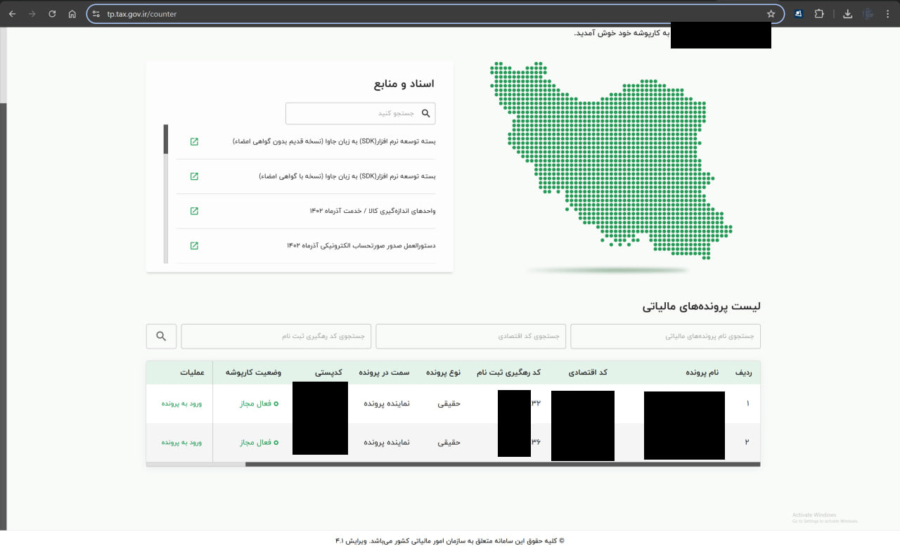
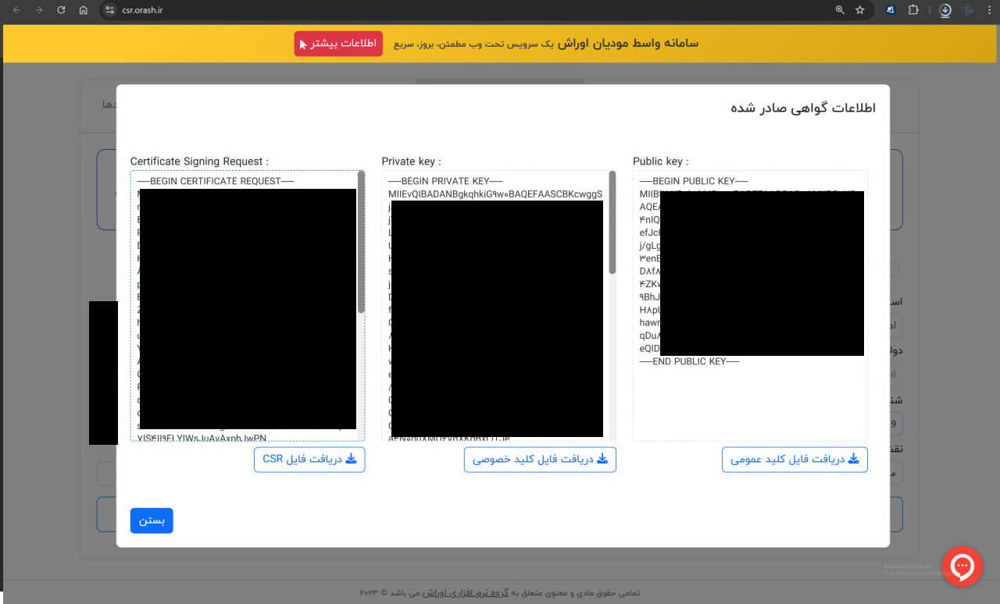

# moadian-api-example

This repository provides a simple step-by-step PHP example of how to connect to the official Moadian API of Iran's tax organization.

> A step-by-step PHP implementation for connecting to the Iranian National Tax Administration’s (INTA) Moadian API. It guides you through generating a nonce token, signing it with digital certificates using JWS (JSON Web Signature), and sending authenticated requests to the API-providing a clear workflow for secure integration with Iran's electronic.

## What is the Moadian API?

The Moadian API is a web service provided by Iran's tax authority (`tp.tax.gov.ir`) to help businesses digitally issue, submit, and manage their invoices and tax data. This API uses digital signatures, secure tokens, and certificate-based authentication.

## How to Use

There are **three key steps** involved in authenticating and sending a request to the Moadian API:

1. **Get a Nonce Token**  
   This is a temporary token (valid between 10 and 200 seconds) used for generating a signed request.

2. **Generate a JWS Token**  
   Using your private key, public key, and certificate, generate a **JWS (JSON Web Signature)** based on the nonce. This token is used to authenticate further API requests. (Note: JWS is not the same as JWT.)

3. **Send API Request**  
   Use the JWS token to authenticate and make requests, such as querying the server status or submitting invoices.

### Run the Example

We've created 3 simple PHP scripts:

```bash
php nonce.php              # Step 1 - Get Nonce Token
php jws.php                # Step 2 - Generate JWS
php server-information.php # Step 3 - Send API Request
```

Before running the scripts, make sure you:

- Add your private key, public key, and certificate to the same folder
- Edit `jws.php` and configure the path to your key files

---

## Documentation

- API Base URL: `https://tp.tax.gov.ir/requestsmanager/api/v2/`
- Official Documentation (as of 2025-05-25):  
  [دانلود دستورالعمل فنی اتصال به سامانه مؤدیان (نسخه دوم)](https://www.intamedia.ir/Portals/0/news/Terminals/%D8%AF%D8%B3%D8%AA%D9%88%D8%B1%D8%A7%D9%84%D8%B9%D9%85%D9%84%20%D9%81%D9%86%DB%8C%20%D8%A7%D8%AA%D8%B5%D8%A7%D9%84%20%D8%A8%D9%87%20%D8%B3%D8%A7%D9%85%D8%A7%D9%86%D9%87%20%D9%85%D9%88%D8%AF%DB%8C%D8%A7%D9%86_2.pdf?ver=yHtC9Lnqny-NoKyYZqUd8w%3D%3D)

[View PDF file documentation](دستورالعمل%20فنی%20اتصال%20به%20سامانه%20مودیان.pdf)

---

## Getting Started with Moadian

### 1. Register

- Visit [my.tax.gov.ir](https://my.tax.gov.ir)
- Register your organization or company

### 2. Get Your Keys (In Person)

Go to your local tax office and request:

- Private Key
- Public Key
- Certificate File

You will receive a `.rar` or `.zip` archive with your cryptographic materials.


### 3. Log in and Configure

- Sign in at [my.tax.gov.ir](https://my.tax.gov.ir) with OTP verification  
- Enter the platform and click on **"ورود به کارپوشه"** to reach `tp.tax.gov.ir`





Follow the steps and upload your **public key**.


Finally you have a key now. keep it, we will need to use this key.


---

## Alternative Tools

### Online Services

- [https://moadian.finto.ir](https://moadian.finto.ir) allows you to generate private/public/CSR files and manage invoices online.

> ⚠️ You can generate keys online but you won't receive a certificate file. Without a certificate, you can't directly connect using your own API/code.


### Other Key Generators

- [https://csr.orash.ir](https://csr.orash.ir)



---

## Summary Screenshot from Official Docs


---

## Final Step

Once you have your keys and certificate:

- Go to [https://tp.tax.gov.ir/membership/normalUniqueID/add](https://tp.tax.gov.ir/membership/normalUniqueID/add)
- Register and connect your certificate

---

## Using

We need to follow 3 steps until connecting and sending a test request to Moadian webservice.

1- First step is to get nonce token which is a random token that is valid from 10s up to 200s. (You have short time to use this token and do your job, so max is 200s and min is 10s and default is 30s)

2- Second step is to use your certificate, private key, etc to mix nonce token with your keys to generate a JWS. JWS is different form JWT. we are going to use JWS token in the future requets in header.

3- Now everything is done, and you can use the token in your requests. for example here we are just going to send a test request to fetch server information from Moadian tax.gov.ir API webservice.

```bash
$ php server-information.php
```

Before running the script, you need to make sure you filled your key (`$clientId = 'xxxxxxxxx';`) in `jws.php` file and you have your private, public, certificate key files in the current root path.

## Documentation

Base API of second version is `https://tp.tax.gov.ir/requestsmanager/api/v2/`.

Latest version at thie date 05/25/2025 is this PDF:

https://www.intamedia.ir/Portals/0/news/Terminals/%D8%AF%D8%B3%D8%AA%D9%88%D8%B1%D8%A7%D9%84%D8%B9%D9%85%D9%84%20%D9%81%D9%86%DB%8C%20%D8%A7%D8%AA%D8%B5%D8%A7%D9%84%20%D8%A8%D9%87%20%D8%B3%D8%A7%D9%85%D8%A7%D9%86%D9%87%20%D9%85%D9%88%D8%AF%DB%8C%D8%A7%D9%86_2.pdf?ver=yHtC9Lnqny-NoKyYZqUd8w%3D%3D

## Useful URLs

- https://csr.orash.ir/#check
- https://movadian.com/blog/%D8%AF%D8%B1%DB%8C%D8%A7%D9%81%D8%AA-%DA%AF%D9%88%D8%A7%D9%87%DB%8C-%D8%A7%D9%85%D8%B6%D8%A7%DB%8C-%D8%A7%D9%84%DA%A9%D8%AA%D8%B1%D9%88%D9%86%DB%8C%DA%A9%DB%8C-csr/
- https://www.gica.ir/portal/
- https://www.hoofer.cloud/%D8%AF%D8%B1%DB%8C%D8%A7%D9%81%D8%AA-%DA%AF%D9%88%D8%A7%D9%87%DB%8C-%D8%A7%D9%84%DA%A9%D8%AA%D8%B1%D9%88%D9%86%DB%8C%DA%A9%DB%8C-%D8%A8%D8%A7-csr/
- https://www.gica.ir/portal/
- https://landing.sepidarsystem.com/dl-csr/?_gl=1*1k2878q*_gcl_au*NTc4MjE3MTEuMTc0NjgyMDQ5MA..
- https://www.sepidarsystem.com/blog/how-to-receive-csr-electronic-signature/
- https://www.intamedia.ir/Portals/0/news/Terminals/%D8%AF%D8%B3%D8%AA%D9%88%D8%B1%D8%A7%D9%84%D8%B9%D9%85%D9%84%20%D9%81%D9%86%DB%8C%20%D8%A7%D8%AA%D8%B5%D8%A7%D9%84%20%D8%A8%D9%87%20%D8%B3%D8%A7%D9%85%D8%A7%D9%86%D9%87%20%D9%85%D9%88%D8%AF%DB%8C%D8%A7%D9%86_2.pdf?ver=yHtC9Lnqny-NoKyYZqUd8w%3d%3d
- https://sandboxrc.tax.gov.ir/membership/normalUniqueID
- https://jwt.io/
- https://tp.tax.gov.ir/membership/normalUniqueID/add
- https://moadian.finto.ir/settings/TSP

---

## License

**MIT License**

© 2025 [Max Base](https://github.com/BaseMax)
